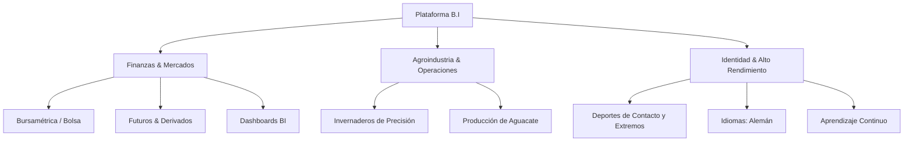

# 🚀 Visión General del Proyecto: B.I

> **Nombre del Proyecto:** B.I (Business Intelligence & Personal Brand Platform)  
> **Propietario:** Bernardo Chávez Rojo  
> **Estado:** Fase de Arquitectura & Configuración de Contexto

---

## 🎯 Propósito del Proyecto
El proyecto **B.I** es una plataforma digital de vanguardia que consolida la identidad profesional, el perfil analítico y la visión estratégica de **Bernardo Chávez Rojo**. 

El proyecto integra tres pilares fundamentales:
1. **Inteligencia de Negocios & Mercados Financieros (BI & Finance):** Enfoque en modelos predictivos, análisis de la bolsa de valores, derivados, futuros y automatización de datos.
2. **Agrotech & Operaciones Reales:** Gestión y monitoreo de invernaderos y plantaciones de aguacate mediante métricas e inteligencia operativa.
3. **Alto Rendimiento & Marca Personal:** Transmitir disciplina, resiliencia (deportes de contacto y extremos) y una mentalidad de aprendizaje continuo (idiomas, tecnología).

---

## 🏛️ Pilares de la Experiencia

---

## 🌟 Propuesta de Valor para Visitantes y Reclutadores / Socios
- Demostrar una combinación única de **rigor analítico cuantitativo**, experiencia operativa en el mundo real (campo/agro) y audacia para la toma de decisiones en entornos de alta presión.
- Proveer una experiencia de usuario del más alto nivel estético e interactivo (Dark Luxury / Cinematic UI).
