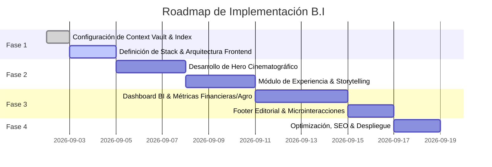

# 🗺️ Hoja de Ruta (Roadmap) y Próximos Pasos

> **Proyecto:** B.I  
> **Objetivo:** Plan de acción modular para la construcción e iteración del proyecto.

---

## 📅 Fases de Desarrollo

---

## 🛠️ Stack Tecnológico Sugerido

- **Framework Web:** [Next.js (App Router)](https://nextjs.org/) o [Vite + React](https://vitejs.dev/) + [TypeScript](https://www.typescriptlang.org/)
- **Estilos:** [Tailwind CSS](https://tailwindcss.com/)
- **Animaciones & Motion:** [Framer Motion](https://www.framer.com/motion/) / [GSAP](https://gsap.com/)
- **Iconografía:** [Lucide React](https://lucide.dev/) / [Phosphor Icons](https://phosphoricons.com/)
- **Visualización de Datos / BI:** [Recharts](https://recharts.org/) / [Tremor](https://www.tremor.so/) / [ECharts](https://echarts.apache.org/)

---

## 📋 Checklist de Próximas Tareas
- [x] Configurar Context Vault y extraer información de archivos fuente.
- [x] Indexar referencias de diseño visual y perfil de Bernardo.
- [ ] Inicializar repositorio de código frontend (ej. Next.js / Vite Tailwind).
- [ ] Construir prototipo del Cinematic Hero basado en las inspiraciones *DID Global Cinema* y *Ferrari Movie*.
- [ ] Integrar visualizaciones interactivas de datos y módulos de experiencia.
